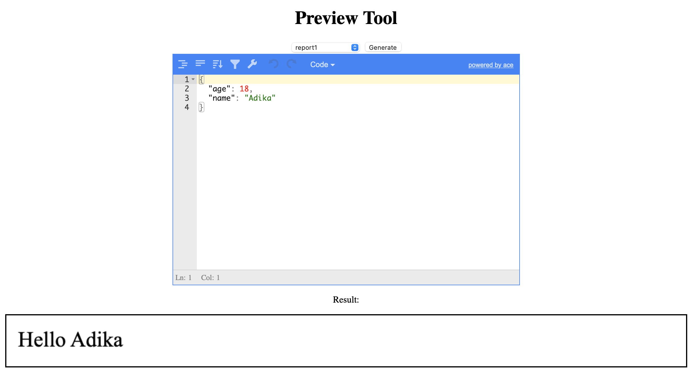

# go-report-builder

## Why
In the e-commerce business, you always have need to print labels, invoices and build reports online.  
We've built this tool at Adika to get rid of the cumbersome process of creating such reports and moving them
to the server side.
  
## How

1) Build your template in pure HTML, for example:
2) Use [go's templating language](https://curtisvermeeren.github.io/2017/09/14/Golang-Templates-Cheatsheet) to template the data of your report.
3) Start go-report-builder with a reference to the folder containing your templates: `go-report-builder <TEMPLATES PATH>`
4) Use the API to export your rendered html report to HTML, PDF and PNG. 

Example of html report:
```html
<!DOCTYPE html>
<html>
<head>
	<style>
		body {
			width: 150mm;
			height: 100mm;
		}
	</style>
</head>
<body>

<div id="printable">
	Hello {{ .Values.name }}
</div>

</body>
</html>
```

## Example

## Api Reference

### List Reports
Will return a list of all loaded reports: 

Url: ```GET /reports/list```
Example Response:
```json
{
  "list": [
    "report1",
    "withdata/report2",
    "withdata/report3"
  ]
}
```

### Render Report
Will render a report (as HTML) using the provided data.

Url: `GET /reports/render/${reportId}?d=${base64Data}`
Response: the rendered HTML report.

### Preview (and debug) Report
Will open a web page that allows you to debug and test your reports.

Url: `GET /reports/preview/${reportId}?d=${base64Data}`
Response: the rendered HTML preview tool.


### Export HTML/PDF/PNG
Will create a base64 encoded string containing your rendered report:


Urls:   
`POST /reports/export/html/${reportId}`  
`POST /reports/export/pdf/${reportId}`  
`POST /reports/export/png/${reportId}`  

Body: json body that represents the data input for that report.

Response: json response with the base64 encoded content:
```json
{
    "reportId": "myReport",
    "type": "png",
    "data": "[BASE64 CONTENT]"
}
``` 